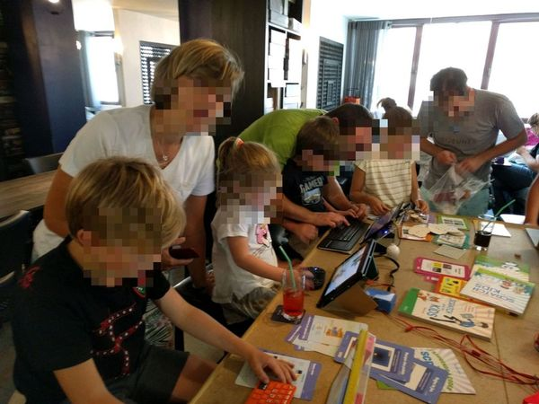
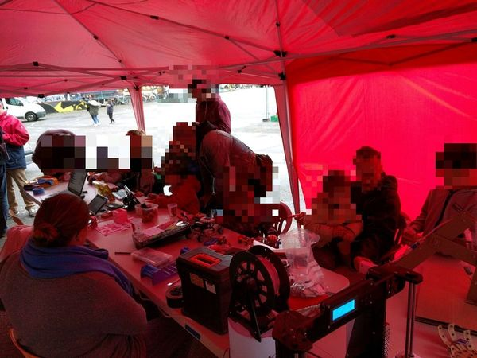
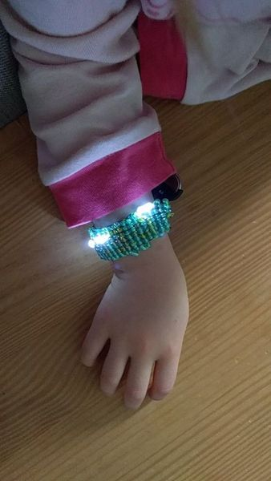
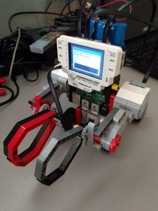

# ludigeeks
fun-filled geeky projects developped by [LudiGeeks community](http://meetup.com/ludigeeks) .

We put here funny projects that we made for people from 5 to 95 years old some need background others doesn't need it.

## Projects

Other projects Coming soon...

