# LudiGeeks 

LudiGeeks project aims to create and provice activities for everyone that can read - write - count to discover and understand cybersecurity topics by funny hands'on maker activities.

Fun-filled geeky projects developped by [WOCSA LudiGeeks project](https://www.wocsa.org/pages/projects.php#ludigeeks) .

We put here funny activities that we made for people from 5 to 95 years old some need background others doesn't need it at all.

[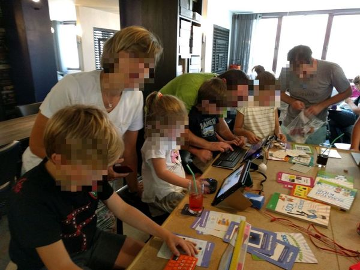](https://www.wocsa.org/pages/projects.php#ludigeeks)

[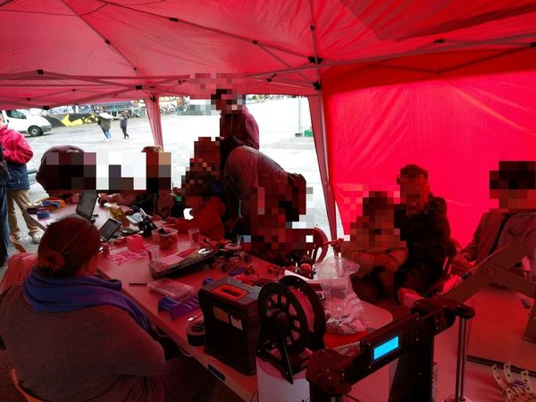](https://www.thsf.net/workshops.html)

[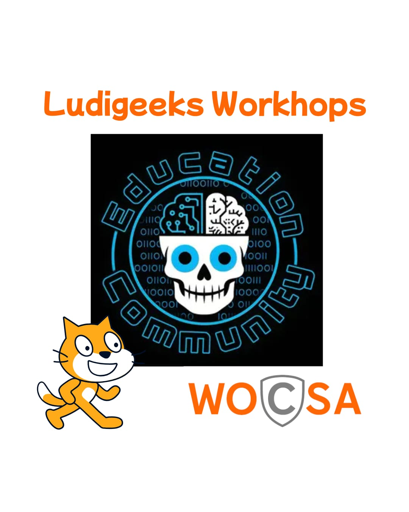](https://www.wocsa.org/pages/projects.php#ludigeeks)

[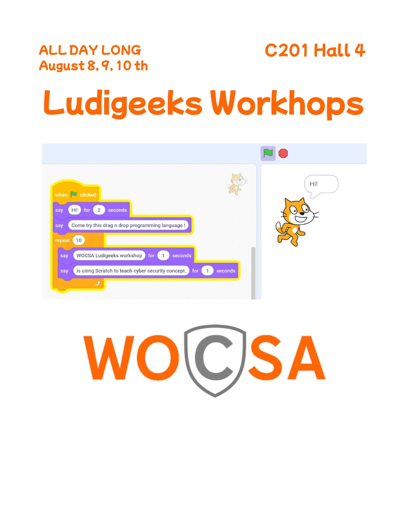](https://www.wocsa.org/pages/projects.php#ludigeeks)

## DEF CON 33

Pictures from the LudiGeeks workshops at DEF CON 33.

  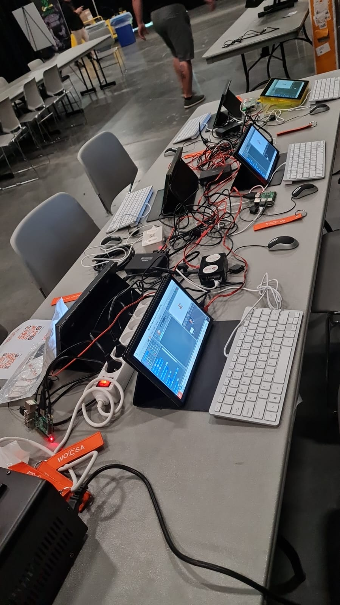
  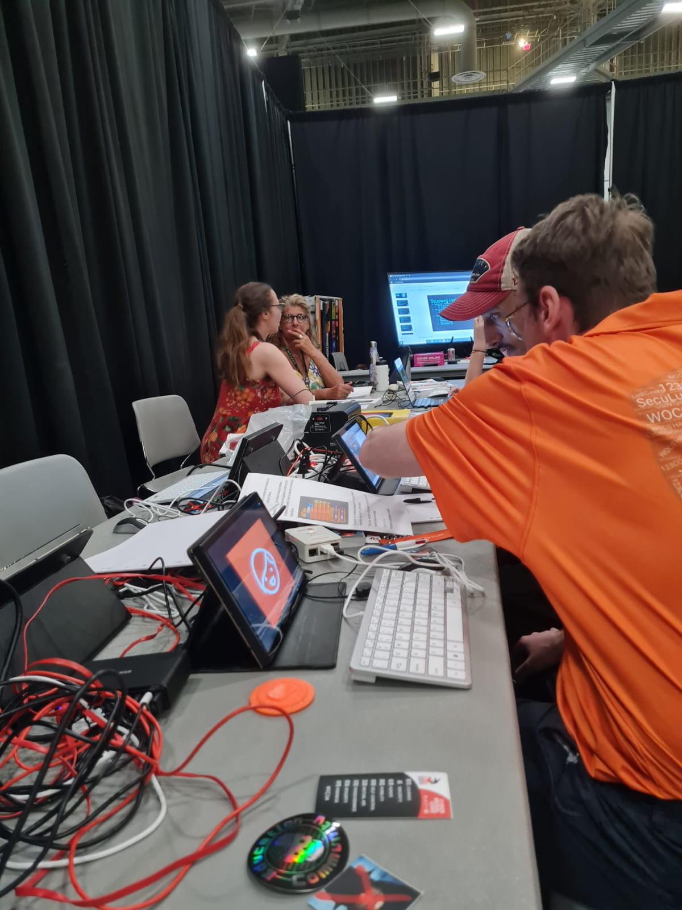
  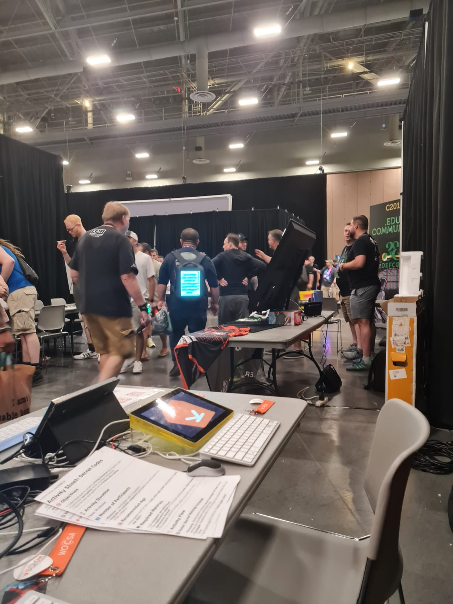
  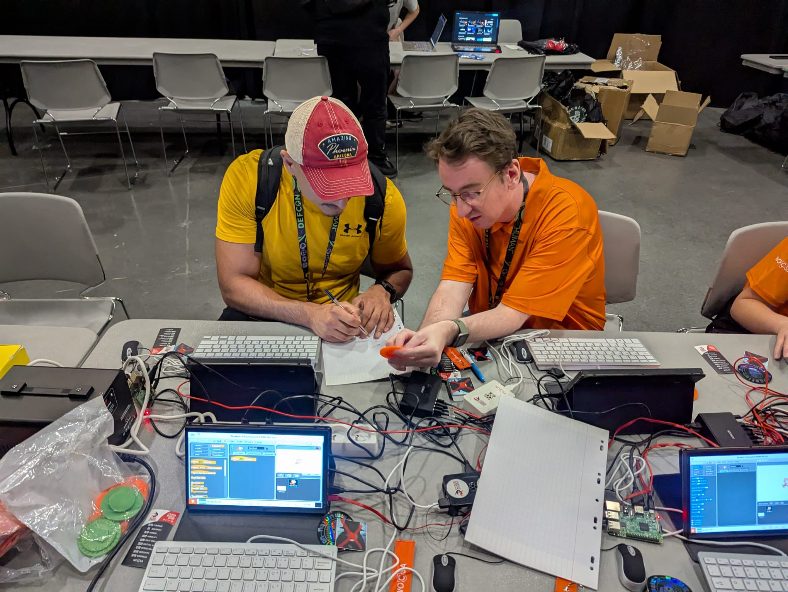

  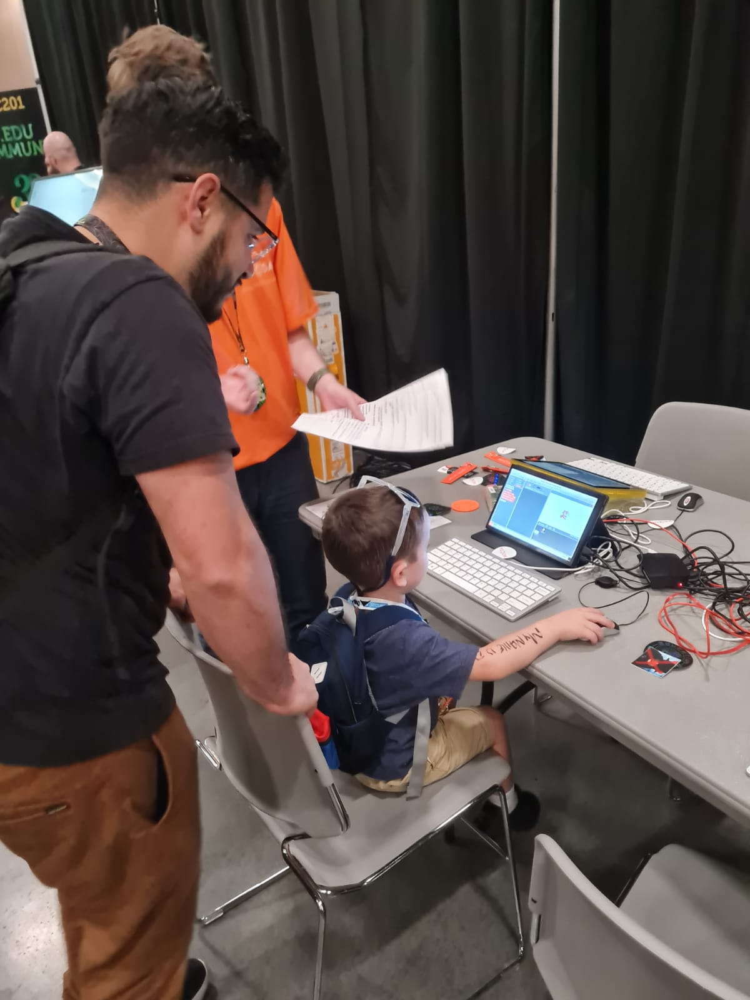
  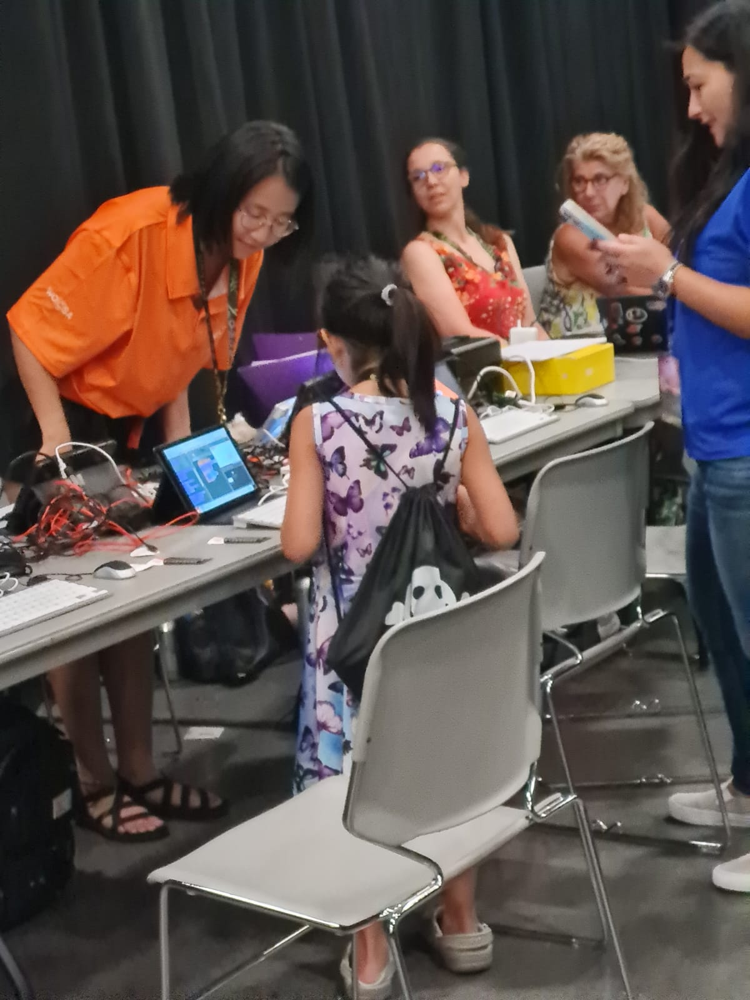
  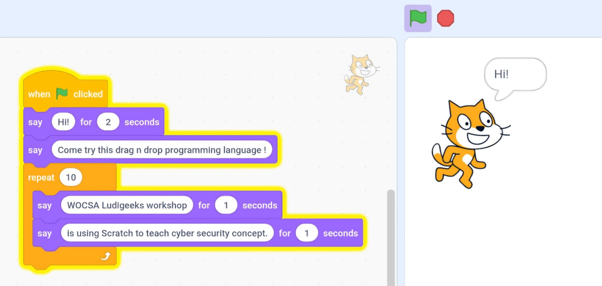
  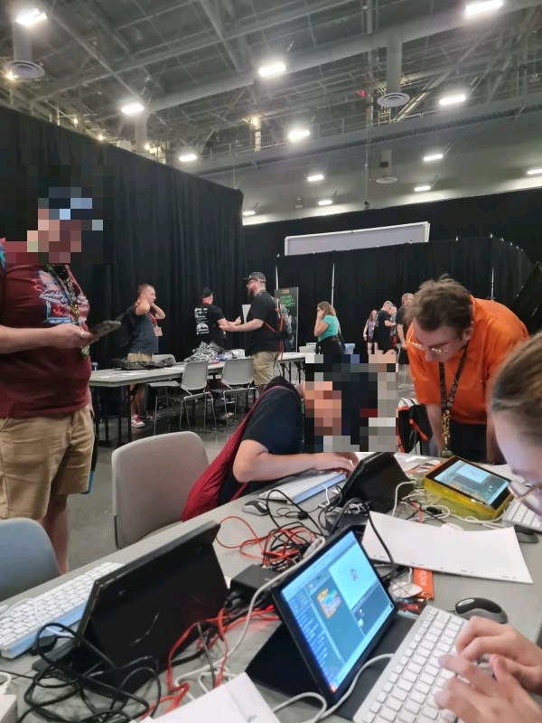

## Activities

[Secret Box](/projects/secret_box/README.md)

[Secret Code](/projects/secret_code/README.md)

[Chat](/projects/chat/README.md)

[MinInternet](/projects/mininternet/README.md)

Other activities Coming soon...
We need volunteers please read [how to contribute](/docs/CONTRIBUTE.md).

## Local communities
### France
- [Toulouse](https://www.meetup.com/fr-FR/ludigeeks-toulouse/)
- [Paris](https://www.meetup.com/wocsa-paris/)

